# 🤖 GigaGPTChat Web App

Современное веб-приложение для диалога с нейросетью GigaChat от Сбера. Реализует интерфейс, аналогичный ChatGPT, с использованием публичного API GigaChat и фирменного стиля Сбера.

## 📋 Оглавление

- [Возможности](#-возможности)
- [Технологический стек](#-технологический-стек)
- [Архитектура](#-архитектура)
- [Установка и запуск](#-установка-и-запуск)
- [Переменные окружения](#-переменные-окружения)
- [Использование](#-использование)
- [API интеграция](#-api-интеграция)
- [Соответствие требованиям GigaChat API](#-соответствие-требованиям-gigachat-api)
- [Лицензия](#-лицензия)

## ✨ Возможности

### 💬 Интерфейс чата

- **Потоковый режим (Streaming)** — ответы нейросети отображаются токен за токеном в реальном времени через Server-Sent Events
- **Fallback на REST** — при сбое SSE автоматически переключается на обычный REST-запрос
- **Markdown рендеринг** — полная поддержка GitHub Flavored Markdown (заголовки, списки, таблицы, ссылки)
- **Подсветка синтаксиса кода** — автоматическое определение языка и подсветка в блоках кода (Prism.js)
- **Копирование ответов** — быстрое копирование в буфер обмена с визуальной обратной связью
- **Остановка генерации** — возможность прервать длинный ответ в любой момент через AbortController
- **Автоскролл** — автоматическая прокрутка к последнему сообщению
- **System-промпт** — автоматическое добавление системного сообщения для корректного поведения ассистента

### 🗂️ Управление чатами

- **Боковая панель (Sidebar)** — список всех чатов с удобным переключением
- **CRUD операции** — создание, чтение, обновление и удаление чатов
- **Поиск по чатам** — фильтрация по названию и содержимому сообщений (case-insensitive)
- **Inline-редактирование** — редактирование названий чатов прямо в списке (Enter/Escape)
- **Удаление с подтверждением** — защита от случайного удаления
- **Автопереключение** — при удалении активного чата выбирается соседний
- **Персистентность** — сохранение всех чатов в localStorage через lazy initializer
- **Сохранение активного чата** — при перезагрузке открывается тот же чат

### 🧠 Работа с моделями GigaChat

- **Выбор модели** — переключение между доступными моделями GigaChat
- **Динамическая загрузка** — список моделей загружается из API с fallback на встроенный список
- **Сохранение выбора** — выбранная модель сохраняется в localStorage
- **Автоподстановка** — выбранная модель автоматически используется во всех запросах

### 🎨 Дизайн и UX

- **Темная тема** — глубокие темные оттенки с зелеными акцентами для комфортной работы
- **Фирменный стиль Сбера** — зеленая палитра (#21A038), градиенты, современные скругления
- **Векторные иконки** — профессиональные SVG-иконки из lucide-react
- **Адаптивные анимации** — плавные переходы и fade-in эффекты
- **Кастомный скроллбар** — в фирменных цветах приложения
- **Error Boundaries** — обработка ошибок на уровне компонентов с понятным UI
- **Примеры запросов** — карточки с подсказками для быстрого старта

## 🛠 Технологический стек

### Frontend

- **React 18+** — библиотека для построения UI с Concurrent Mode
- **TypeScript 5** — статическая типизация для надежности кода
- **Vite** — быстрый сборщик с встроенным dev-сервером

### State Management

- **Context API + useReducer** — встроенное решение React для глобального состояния
- **Lazy Initializer** — синхронная загрузка состояния из localStorage
- **useMemo/useCallback** — оптимизация производительности
- **Разделение контекстов** — отдельные провайдеры для чатов и моделей

### Стилизация

- **Tailwind CSS 3** — utility-first CSS фреймворк
- **CSS Variables** — централизованная палитра фирменных цветов Сбера
- **PostCSS + Autoprefixer** — автоматическая обработка CSS
- **Темная тема** — единая палитра без возможности переключения

### API и интеграции

- **Fetch API** — нативный HTTP-клиент с поддержкой AbortController
- **ReadableStream** — потоковое чтение SSE (Server-Sent Events)
- **Vite Proxy** — обход CORS-политики в dev-режиме (отдельные прокси для API и OAuth)
- **Fallback-стратегия** — автоматическое переключение с SSE на REST

### Библиотеки

- **react-markdown** — рендеринг Markdown контента
- **remark-gfm** — поддержка GitHub Flavored Markdown
- **react-syntax-highlighter** — подсветка синтаксиса кода (Prism.js)
- **lucide-react** — современные векторные иконки

## 🏗 Архитектура

Проект использует **модульную архитектуру** с элементами **Feature-Sliced Design (FSD)**:

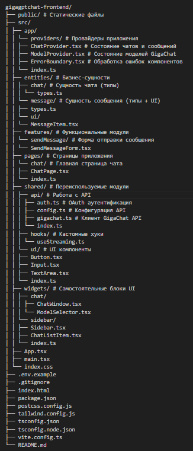

### Ключевые паттерны

- **Adapter Pattern** — API-слой инкапсулирует работу с GigaChat API
- **Composition Pattern** — UI компоненты строятся через композицию
- **Context Pattern** — глобальное состояние через Context API
- **Custom Hooks** — логика инкапсулирована в переиспользуемых хуках
- **Error Boundaries** — изоляция ошибок на уровне компонентов
- **Lazy Initializer** — предотвращение race condition при загрузке из localStorage
- **Graceful Degradation** — fallback с SSE на REST при ошибках

## 🚀 Установка и запуск

### Предварительные требования

- **Node.js** версии 18 или выше
- **npm** версии 9 или выше
- **Authorization Key** от GigaChat API (получить в [личном кабинете](https://developers.sber.ru/studio/workspaces/ru/sberchat-v2))

### Шаги установки

1. **Клонировать репозиторий**
   git clone https://github.com/akimkish/MIPT/tree/master/gigagptchat-frontend && cd gigagptchat-frontend

2. **Установить зависимости**
- npm install

3. **Создать файл окружения**
- cp .env.example .env

4. **Настроить переменные окружения**
- Откройте .env и добавьте ваш VITE_AUTH_KEY:
VITE_AUTH_KEY=your_authorization_key_here

5. **Запустить dev-сервер**
- npm run dev

6. **Открыть приложение**
- Перейдите по адресу http://localhost:5173

## 🔐 Переменные окружения

**VITE_AUTH_KEY** - Authorization Key для OAuth аутентификации в GigaChat API

**Как получить Authorization Key**

1. Зарегистрируйтесь на developers.sber.ru
2. Создайте проект в разделе GigaChat API
3. Получите Authorization Key в настройках проекта
4. Скопируйте его в .env файл

## 📖 Использование

**Создание нового чата**

1. Нажмите кнопку "+ Новый чат" в боковой панели
2. Или просто начните вводить сообщение в поле ввода — чат создастся автоматически

**Отправка сообщений**

- Введите текст в поле ввода внизу экрана
- Нажмите Enter или кнопку отправки
- Для новой строки используйте Shift+Enter
- Во время генерации можно нажать кнопку остановки (красный квадрат ⏹)

**Выбор модели**

1. Нажмите на селектор модели в правом верхнем углу заголовка (название текущей модели + стрелка)
2. Выберите нужную модель из списка (GigaChat, GigaChat-Plus, GigaChat-Pro, GigaChat-Max)
3. Выбор сохраняется автоматически в localStorage

**Работа с чатами**

- Переключение — клик по чату в боковой панели
- Редактирование — наведите на чат и кликните по иконке карандаша
- Удаление — наведите на чат и кликните по иконке корзины
- Поиск — используйте поле поиска в верхней части боковой панели

**Копирование ответов**

1. Наведите курсор на ответ ассистента
2. Кликните по кнопке "Копировать" под сообщением
3. Иконка сменится на галочку ✓ с подтверждением

**Автосохранение**

- Все чаты автоматически сохраняются в localStorage
- При перезагрузке страницы восстанавливаются чаты и активный чат
- Выбранная модель также сохраняется между сессиями

## 🔌 API интеграция

**Используемые эндпоинты**

- POST /api/v2/oauth - Получение Access Token через OAuth
- POST /api/v1/chat/completions - Отправка сообщений
- GET /api/v1/models - Получение списка доступных моделей

## OAuth аутентификация

Приложение использует двухэтапную аутентификацию:

1. Получение Access Token через POST /api/v2/oauth с Authorization Key
2. Использование Access Token в заголовке Authorization: Bearer <token> для API запросов

## CORS обход

В development-режиме используются два отдельных прокси Vite:
// vite.config.ts
proxy: {
// Прокси для основного API
'/api/v1': {
target: 'https://gigachat.devices.sberbank.ru',
changeOrigin: true,
secure: false,
},
// Прокси для OAuth (другой домен и порт)
'/oauth': {
target: 'https://ngw.devices.sberbank.ru:9443',
changeOrigin: true,
secure: false,
rewrite: (path) => path.replace(/^\/oauth/, ''),
},
}

## ✅ Соответствие требованиям GigaChat API

**Обязательные заголовки запроса:**

- Authorization: Bearer <token> - Автоматически добавляется из sessionStorage
- Content-Type: application/json - Во всех POST-запросах
- Accept: application/json - Для обычных запросов
- Accept: text/event-stream - Для streaming-запросов
  **Формат тела запроса к /chat/completions:**
  {
  "model": "GigaChat",
  "messages": [
  {"role": "system", "content": "Ты полезный ассистент"},
  {"role": "user", "content": "Привет!"},
  {"role": "assistant", "content": "Здравствуйте!"},
  {"role": "user", "content": "Как дела?"}
  ],
  "temperature": 1.0,
  "top_p": 0.9,
  "max_tokens": 2048,
  "stream": true
  }

**Все параметры дефолтных значений централизованно хранятся в src/shared/api/config.ts:**

1. model - "GigaChat" - Модель по умолчанию
2. temperature - 1.0 - Степень креативности ответов
3. top_p - 0.9 - Nucleus sampling
4. max_tokens - 2048 - Максимальная длина ответа
5. stream - true - Включение потокового режима

## Скриншоты

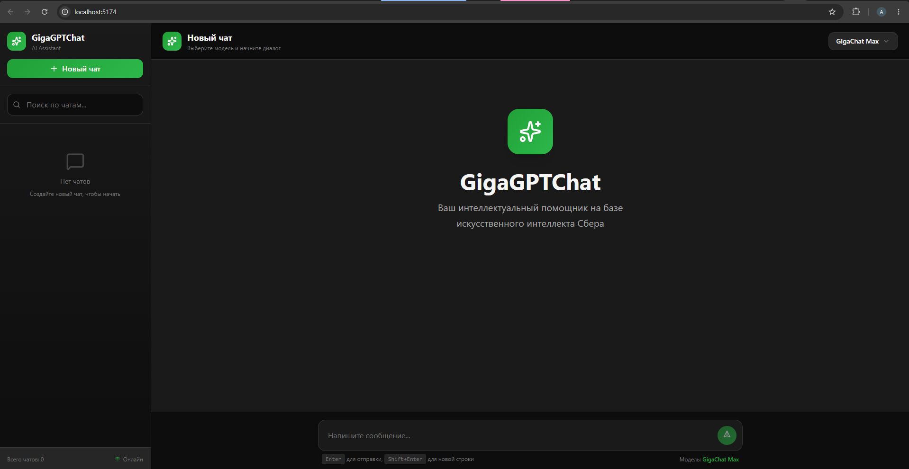

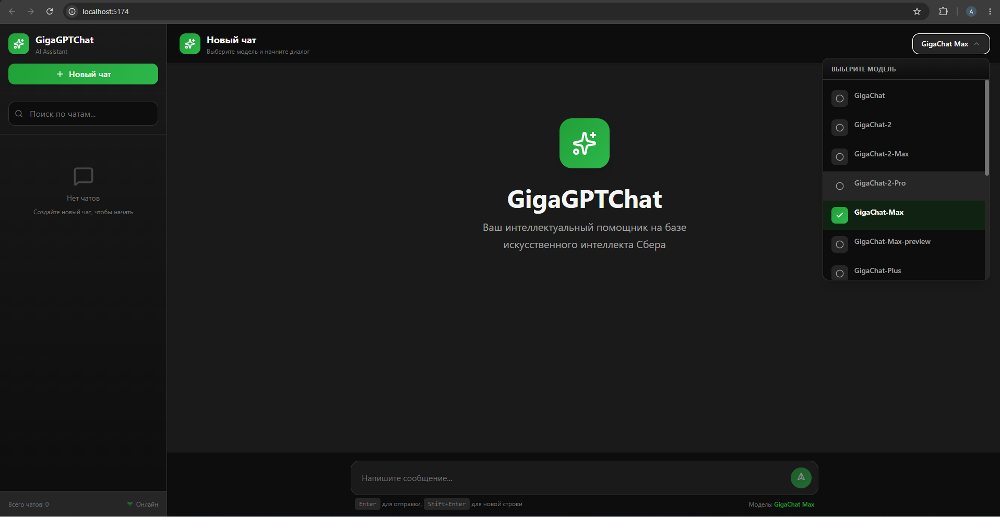

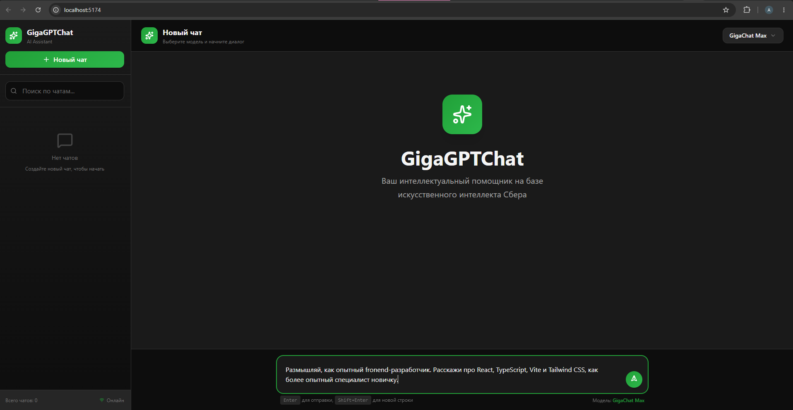

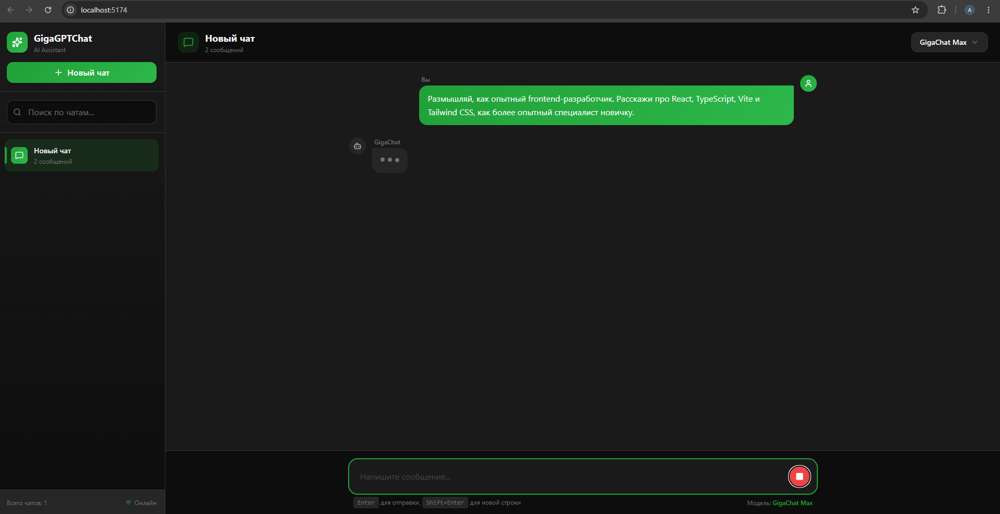

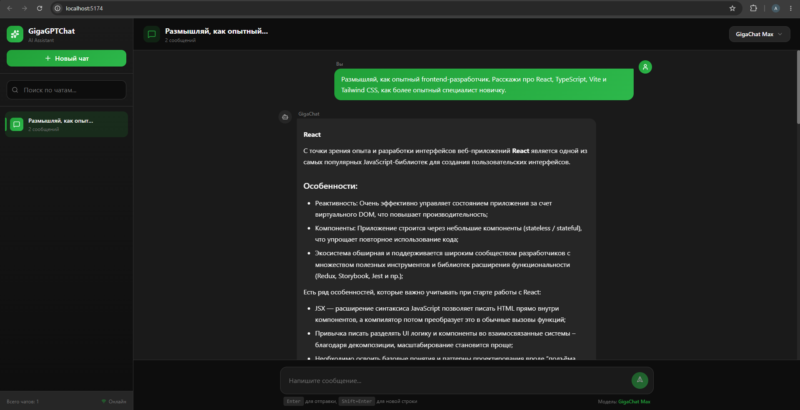

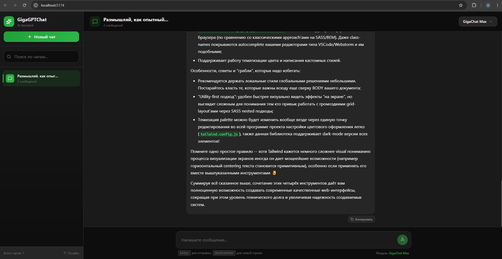

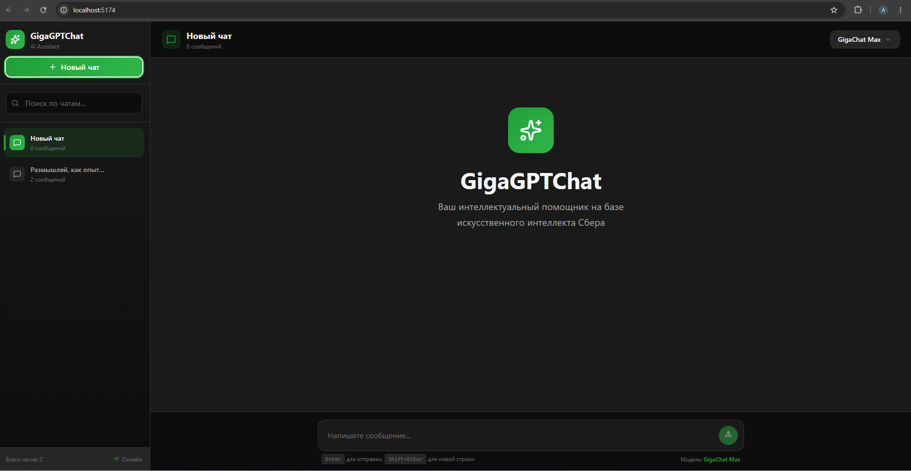

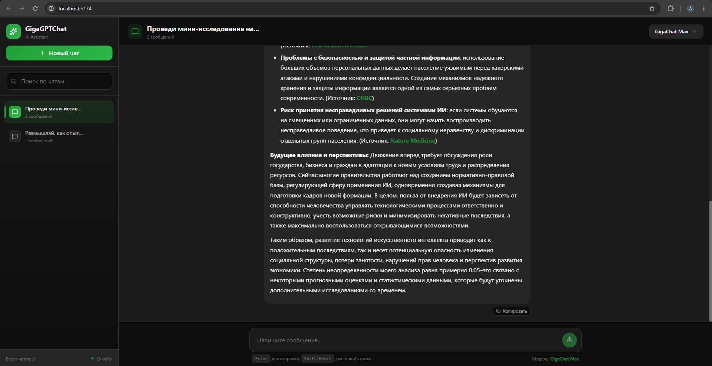

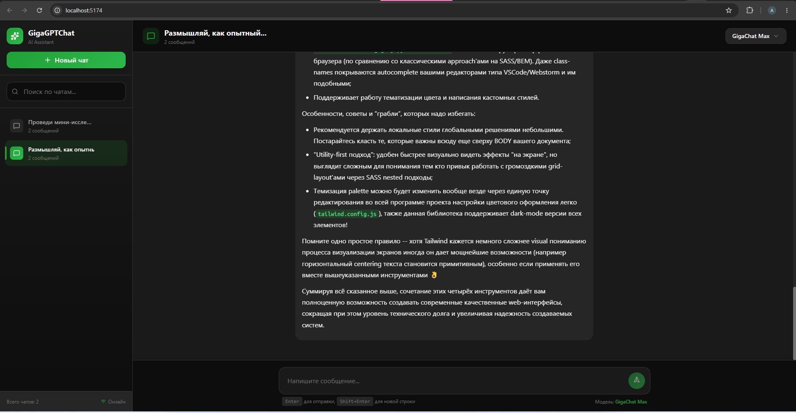

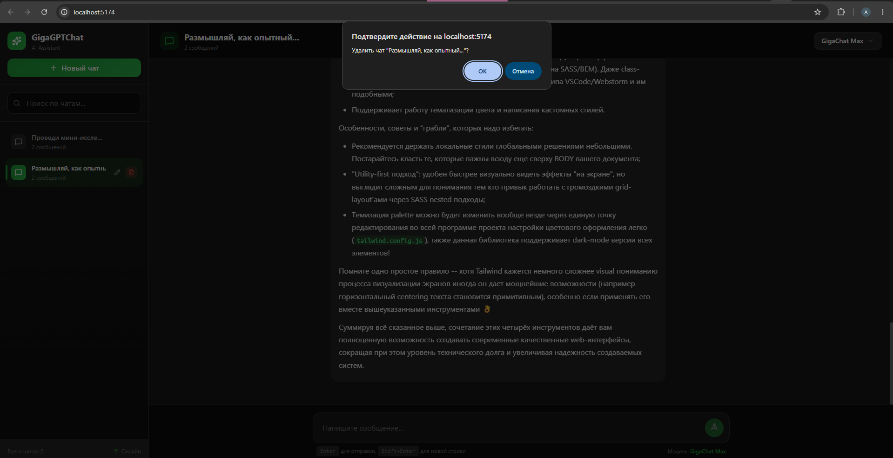

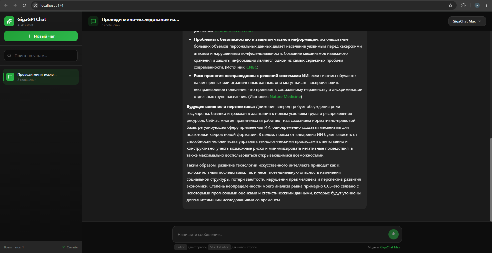

## 📄 Лицензия

Учебный проект. Все права на GigaChat API и фирменный стиль принадлежат ПАО Сбербанк.
